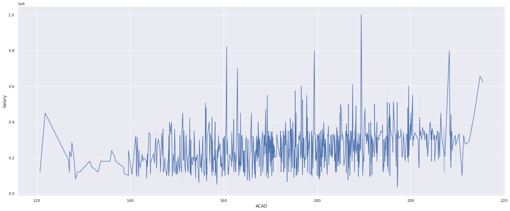
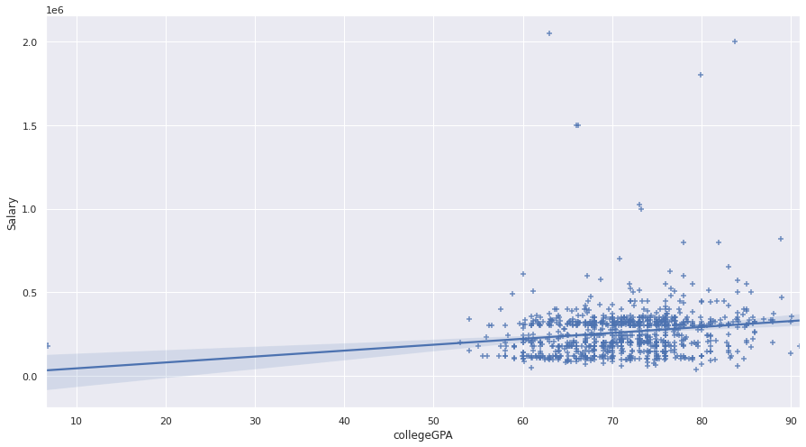
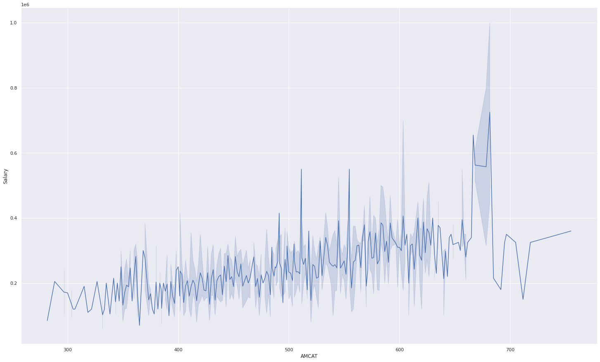
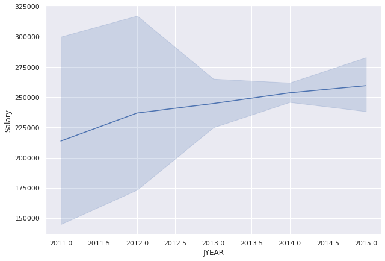
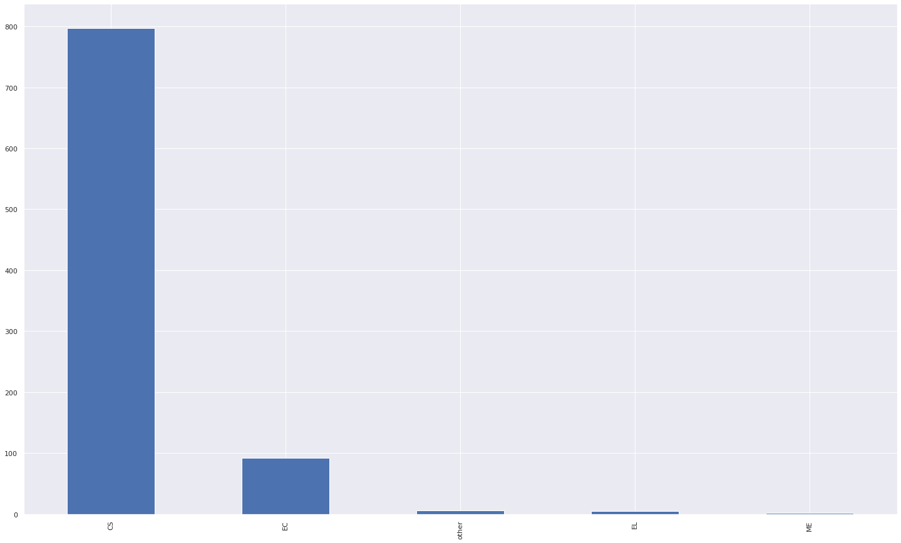

# Aspiring Minds from Aspiring Minds Employment Outcome 2015 (AMEO)


[](https://travis-ci.org/joemccann/dillinger)

So, This project is drwaing insight from the data avilable on Aspiringmind India website. 

  - Type some Markdown on the left
  - See HTML in the right
  - Magic

# About the dataset.

  - Aspiring Minds' Employability Outcomes 2015 (AMEO 2015), a unique dataset which provides engineering graduates' employment outcomes (salaries, job titles and job locations) together with standardized assessment scores in three fundamental areas - cognitive skills, technical skills and personality. Coupled with biodata information, AMEO 2015 provides an opportunity for a unique and comprehensive study of the entry level labor market.

   - The dataset used for this project was taken from the "IKDD CoDS 2016 Data Challenge" which can be found here: http://research.aspiringminds.com/resources/ameo


# Tech Requirement 
  - Look for the requirement.txt file.
OR
  - Open the file in https://colab.research.google.com/

## Importatnt Insights
 > Academics Vs Salary
 > The academics consists of marks of 10, 12 and your college GPA. (Baically the average of all three)
 


> Academics Vs Salary
 > Yor college GPA vs the salary offered gender wise trend.
 



> AMCAT Score Vs Salary
 > The AMCAT score consist of the marks obtained in domain subjects and aptitude.
 


> Increment in offered salary  Vs Years
 > The actual trend in the offered salary over years.
 


> Specialization Vs Salary offered.
 > Basic overview of the packages offered to different specialization.
 



### Installation

Dillinger requires [Node.js](https://nodejs.org/) v4+ to run.

Install the dependencies and devDependencies and start the server.

```sh
$ cd dillinger
$ npm install -d
$ node app
```

For production environments...

```sh
$ npm install --production
$ NODE_ENV=production node app
```

### Download the cleaned dataset

You can download the project or specific datafile.

| Plugin | README |
| ------ | ------ |
| GitHub | [plugins/github/README.md][PlGh] |
| Google Drive | [plugins/googledrive/README.md][PlGd] |
| OneDrive | [plugins/onedrive/README.md][PlOd] |


### Development

Want to contribute? Great!

Dillinger uses Gulp + Webpack for fast developing.
Make a change in your file and instantaneously see your updates!

Open your favorite Terminal and run these commands.

First Tab:
```sh
$ node app
```

Second Tab:
```sh
$ gulp watch
```

(optional) Third:
```sh
$ karma test
```


License
----

MIT


